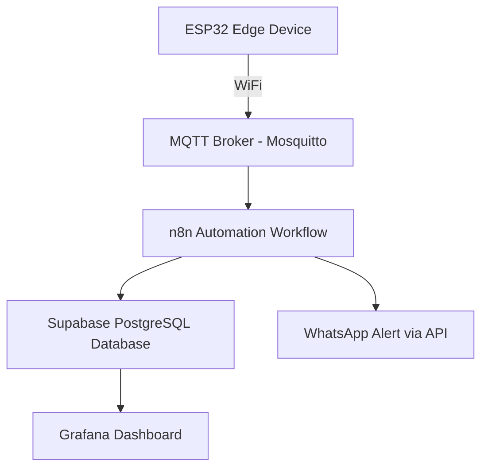
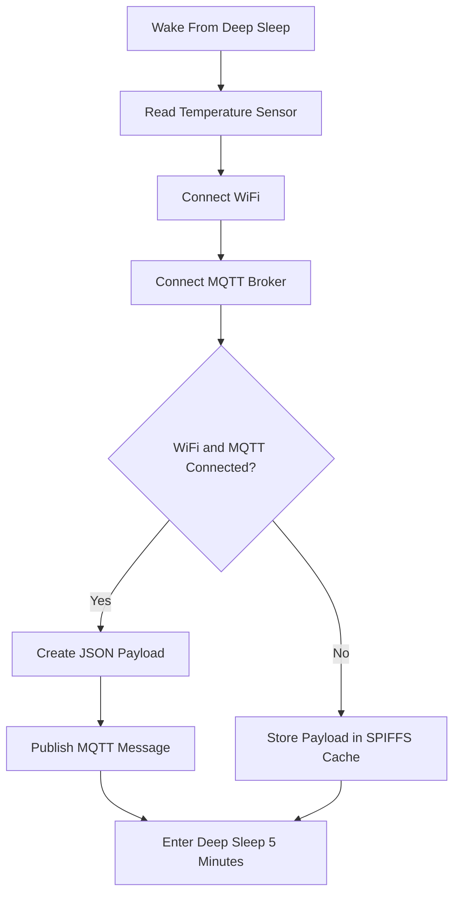
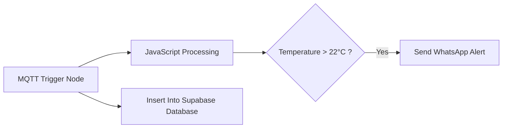

# 📡 ESP32 Cold Chain Temperature Monitoring System

A reliable **IoT-based temperature monitoring system** designed for **pharmacy refrigerators and cold storage monitoring**.

The system ensures:

- Continuous temperature monitoring
- Reliable data delivery
- Local buffering when internet fails
- Automatic alert generation
- Real-time visualization dashboards

The ESP32 device stores data locally using **SPIFFS** when WiFi or MQTT fails and automatically retransmits it when connectivity is restored.

---

# 🏗 System Architecture



---

# 🔧 Edge Device (ESP32)

## Hardware

- ESP32 Microcontroller
- Temperature Sensor  
  - DHT22  
  - NTC Thermistor  
  - Simulated Sensor

---

## Firmware Workflow



---

# 📦 MQTT Telemetry Payload

Example payload sent by ESP32.

```json
{
  "device_id": "esp32_01",
  "temperature": 4.8
}
```

---

# 📡 MQTT Topic

```
hospital/pharmacy/temperature
```

---

# 💾 Offline Data Buffer (SPIFFS)

When network connectivity is lost, the ESP32 stores telemetry locally.

File location:

```
/spiffs/cache.json
```

Example cached data:

```json
[
  {
    "device_id":"esp32_01",
    "temperature":4.7
  },
  {
    "device_id":"esp32_01",
    "temperature":4.8
  }
]
```

When connectivity is restored, the ESP32 automatically retransmits cached records.

---

# 📡 MQTT Broker

Broker software: **Mosquitto**

## Configuration

| Parameter | Value |
|----------|------|
| Host | Local PC |
| Port | 1883 |
| Protocol | MQTT |
| Authentication | Username / Password |
| Encryption | Optional TLS |

## Responsibilities

- Receive telemetry from ESP32
- Manage publish / subscribe topics
- Maintain reliable message routing
- Forward data to automation layer

---

# ⚙ Automation Layer (n8n)

n8n processes telemetry and performs automation tasks.

## Workflow



---

## n8n Nodes Used

- MQTT Trigger Node
- JavaScript Function Node
- Supabase Node
- HTTP Request Node

---

# 🗄 Database Layer

Database: **Supabase PostgreSQL**

Table: **temperature_logs**

| Column | Type |
|------|------|
| id | UUID Primary Key |
| device_id | TEXT |
| temperature | FLOAT |
| timestamp | int8 |
| created_at | TIMESTAMP |

---

## Indexing Strategy

```sql
CREATE INDEX idx_device_id ON temperature_logs(device_id);

CREATE INDEX idx_created_at ON temperature_logs(created_at);
```

Benefits:

- Fast time-series queries
- Efficient device filtering
- Scalable to large datasets

---

# 📊 Monitoring Dashboard

Visualization tool: **Grafana**

## Dashboard Panels

### 1️⃣ Temperature Time-Series Chart

Shows temperature changes over time.

### 2️⃣ Current Temperature Gauge

Displays latest sensor reading.

---

## Example Query

```sql
SELECT
created_at,
temperature
FROM temperature_logs
ORDER BY created_at DESC
LIMIT 100000;
```

---

# 🔋 Power Optimization

ESP32 operates in **Deep Sleep Mode** to reduce power consumption.

### Device Cycle

```
Wake → Read Sensor → Send Data → Sleep (5 minutes)
```

Advantages:

- Extremely low power consumption
- Suitable for battery powered IoT deployments
- Long operational life

---

# 🛡 Reliability Features

✔ Local SPIFFS buffering  
✔ Automatic data retransmission  
✔ MQTT reliable messaging  
✔ Local broker operation without internet  
✔ Automated alert generation  
✔ Persistent database storage  
✔ Real-time monitoring dashboards

---


